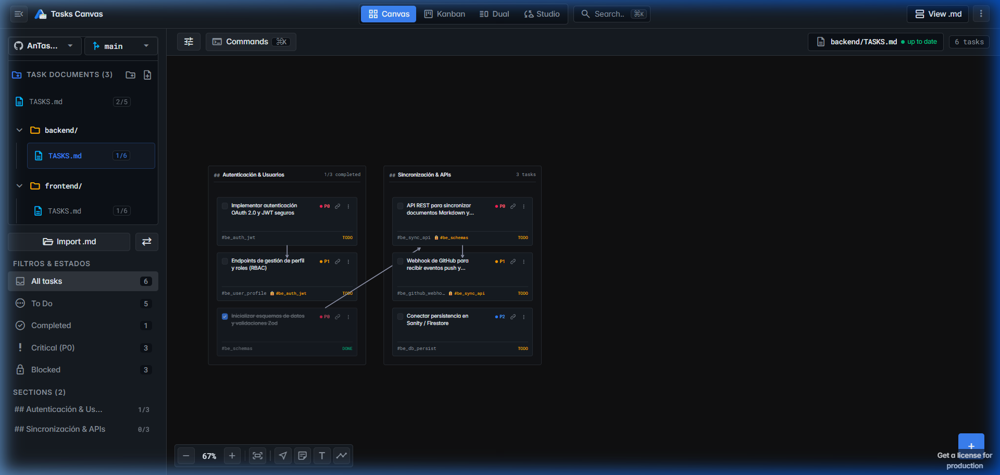
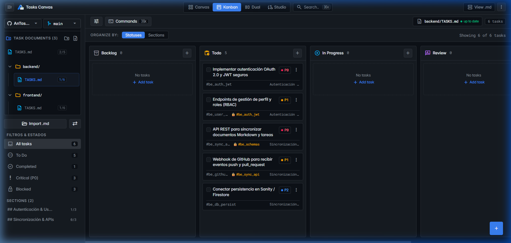
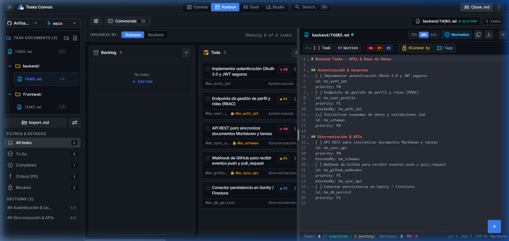
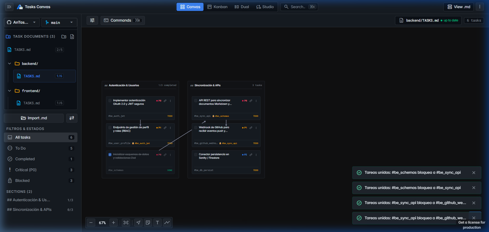
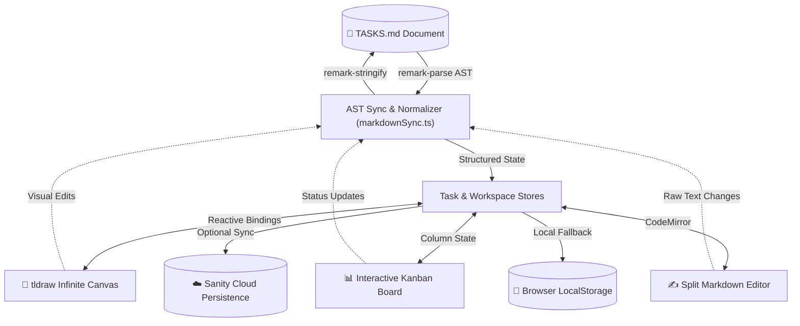

<p align="center">
  
</p>

<h1 align="center">AnTaskCanvas</h1>

<p align="center">
  <strong>Visual, interactive, and bi-directional <code>TASKS.md</code> architecture for modern engineering teams.</strong>
</p>

<p align="center">
  <a href="https://react.dev/"></a>
  <a href="https://www.typescriptlang.org/"></a>
  <a href="https://vitejs.dev/"></a>
  <a href="https://tldraw.dev/"></a>
  <a href="https://lingui.dev/"></a>
  <a href="https://www.sanity.io/"></a>
  <a href="LICENSE"></a>
</p>

---

## 📖 Overview

**AnTaskCanvas** bridges the gap between plain-text Git-versioned task files (`TASKS.md`) and high-density visual project management interfaces. It empowers developers to maintain single sources of truth in Markdown while interacting through an **infinite spatial canvas (`tldraw`)**, a structured **Kanban board**, or a **live split Markdown editor**.

Every action—from dragging a task card to connecting a dependency arrow—is deterministically parsed and synced back to your Markdown file using a robust AST engine.

---

## 📸 DEMO

Experience the primary interactive modes of **AnTaskCanvas**:

### 1. Infinite Spatial Canvas (`tldraw` v5)
> Visual freeform canvas with custom `TaskCard` nodes, section groups, and live Directed Acyclic Graph (DAG) dependency connections (`blockedBy`).

<p align="center">
  
</p>

---

### 2. Interactive Kanban Board
> High-density column workflow (`Todo`, `In Progress`, `Done`, `Blocked`) with instant drag-and-drop state updates and inline editing.

<p align="center">
  
</p>

---

### 3. Live Split Markdown Editor
> Side-by-side CodeMirror Markdown editor with bi-directional AST synchronization—type in Markdown or edit visually with zero data loss.

<p align="center">
  
</p>

---

### 4. Monorepo Document Explorer & Context-Aware Filters
> Manage multi-scope task files (`frontend/TASKS.md`, `backend/TASKS.md`) with filter dropdowns that reactively reconcile with active document tags.

<p align="center">
  
</p>

---

## ✨ Key Features

### 🎨 1. Infinite Spatial Canvas (`tldraw` v5)
- **Visual Card Shapes**: Custom `TaskCard` and `GroupCard` primitives with real-time status indicators, priority badges, and tag chips.
- **Dependency Graph**: Draw explicit `blockedBy` arrows between tasks or let the auto-layout engine arrange tasks via Directed Acyclic Graph (DAG) sorting.
- **Drag-to-Group**: Move tasks seamlessly between section groups directly on the canvas.

### 📊 2. Dynamic Kanban Board
- **Column Lifecycle**: Categorize by completion or custom workflows (`Todo`, `In Progress`, `Done`, `Blocked`).
- **Inline Editing & Fast Transitions**: Change status, priority (`P0`–`P3`), or titles without leaving the board.
- **Contextual Filtering**: Instant multi-tag, priority, and section search.

### ✍️ 3. Lossless Bi-directional AST Markdown Sync
- **Deterministic Remark Parser**: Powered by `unified` and `remark-parse` to preserve non-task prose, custom code blocks, comments, and file headers.
- **Automatic Sanitization**: Auto-assign unique task IDs without destructively reformatting untouched content.
- **Live Split-View**: Watch code updates in real-time as you manipulate visual elements on the canvas or board.

### 📂 4. Multi-Workspace & Document Switcher
- **Monorepo Ready**: Manage distinct `TASKS.md` documents across different project scopes (e.g., `frontend/`, `backend/`, `packages/ui/`).
- **Reactive Filter Consonance**: Filter dropdowns automatically adapt to the specific tags and sections discovered in the currently active document.

### ☁️ 5. Sanity Studio & Cloud Persistence
- **Dual-Storage Engine**: Cloud synchronization with Sanity schemas (`workspace`, `task`, `canvasVisualState`) combined with offline-first local storage recovery.

### 🌍 6. Compiler-First Internationalization (i18n)
- **LinguiJS Integration**: Zero runtime dictionary overhead with compile-time AST message extraction and deterministic hash-based message catalogs (`es`, `en`).

---

## 🏗️ Architecture & Data Flow



---

## 📋 TASKS.md Format & Syntax Specification

AnTaskCanvas reads standard GitHub Flavored Markdown task lists with structured metadata:

```markdown
# Project Roadmap

## Core Architecture
- [ ] Implement bi-directional AST sync
  id: core_ast
  priority: P0
  tags: #parser, #ast

- [x] Configure LinguiJS compiler-first i18n
  id: i18n_setup
  priority: P1
  tags: #i18n

## Frontend Interface
- [ ] Render canvas dependency arrows
  id: fe_arrows
  priority: P0
  blockedBy: core_ast
  tags: #canvas, #tldraw
```

### Supported Metadata Attributes

| Field | Syntax / Values | Description |
| :--- | :--- | :--- |
| **Status** | `- [ ]` (Todo), `- [x]` (Done), `- [-]` (In Progress) | GFM checklist item status. |
| **Task ID** | `id: <unique_id>` | Deterministic unique identifier for linking and persistence. |
| **Priority** | `priority: P0 \| P1 \| P2 \| P3` | Priority level indicator (P0 = Urgent, P3 = Low). |
| **Dependencies**| `blockedBy: <task_id>` | Task ID that must be completed before this task can start. |
| **Tags** | `tags: #tag1, #tag2` | Categorization tags for filtering and grouping. |

---

## 🚀 Quick Start

### Prerequisites
- **Node.js**: `v18.0.0` or higher
- **npm**: `v9.0.0` or higher

### Installation

```bash
# 1. Clone the repository
git clone https://github.com/nicolasalarconrapela/AnCanvasTask.git
cd AnCanvasTask

# 2. Install dependencies
npm install

# 3. (Optional) Configure environment variables
cp .env.example .env

# 4. Start local development server
npm run dev
```

The application will be accessible at **`http://localhost:3000`**.

---

## 🛠️ CLI & Scripts Reference

| Command | Action |
| :--- | :--- |
| `npm run dev` | Starts the Vite development server on port `3000`. |
| `npm run build` | Compiles the production bundle with typechecking and minification. |
| `npm run preview` | Previews the production build locally. |
| `npm run test` | Runs the core verification test suite (`tests/verify_core.ts`). |
| `npm run typecheck` | Validates TypeScript types across the entire codebase. |
| `npm run i18n:extract` | Scans source code and updates translation message catalogs. |
| `npm run i18n:compile` | Compiles translation catalogs into optimized production bundles. |
| `npm run i18n` | Runs both `i18n:extract` and `i18n:compile` sequentially. |

---

## 🧪 Testing Suite

AnTaskCanvas includes a built-in verification suite that validates core lossless parsing, sanitization, auto-ID assignment, and document filtering:

```bash
npm run test
```

Expected output:
```text
--- Iniciando suite de pruebas de AnTaskCanvas (Core sin GitHub) ---
1. Verificando parsing de TASKS.md...
   ✓ Parsing de grupos, tareas y metadatos correcto.
2. Verificando actualización y preservación de contenido...
   ✓ Round-trip seguro y preservación de atributos verificado.
3. Verificando adición y borrado de tareas en Markdown...
   ✓ Adición y borrado no destructivo verificado.
4. Verificando saneado y asignación automática de IDs...
   ✓ Saneado y normalización conservadora verificada.
5. Verificando estructura de Workspaces local y desacoplamiento de GitHub...
   ✓ Estructura de Workspace y documentos locales verificada.
6. Verificando filtrado en consonancia con el documento TASK.md...
   ✓ Consonancia de tareas y secciones por documento seleccionada verificada.
--- ¡Todas las pruebas del núcleo pasaron exitosamente (100%)! ---
```

---

## 📁 Project Structure

```text
AnCanvasTask/
├── public/                  # Static assets & web application manifest
│   ├── logo.png             # Application logo & icon
│   └── manifest.json        # PWA manifest definition
├── src/
│   ├── components/          # Modular UI components (TopBar, Modals, Kanban, SplitEditor)
│   ├── i18n/                # LinguiJS setup, locale providers & Intl formatters
│   ├── locales/             # Compiled and extracted translation catalogs (es, en)
│   ├── services/            # Workspace services & Sanity client integration
│   ├── shapes/              # Custom tldraw shape definitions (TaskShape, GroupShape)
│   ├── utils/               # AST parsing (remark), task filtering & store synchronizers
│   ├── App.tsx              # Root layout & view controller
│   └── main.tsx             # Entry point & global error boundary
├── tests/                   # Core deterministic testing suite
│   └── verify_core.ts       # AST round-trip and filter unit tests
├── lingui.config.ts         # LinguiJS compiler configuration
├── vite.config.ts           # Vite bundler configuration
├── tsconfig.json            # TypeScript compiler configuration
├── CONTRIBUTING.md          # Contribution guidelines
├── CODE_OF_CONDUCT.md       # Community standards
└── LICENSE                  # MIT License
```

---

## 🤝 Contributing

Contributions are welcome! Please read [CONTRIBUTING.md](CONTRIBUTING.md) for details on our code of conduct and the process for submitting pull requests.

---

## 📄 License

This project is licensed under the MIT License - see the [LICENSE](LICENSE) file for details.
